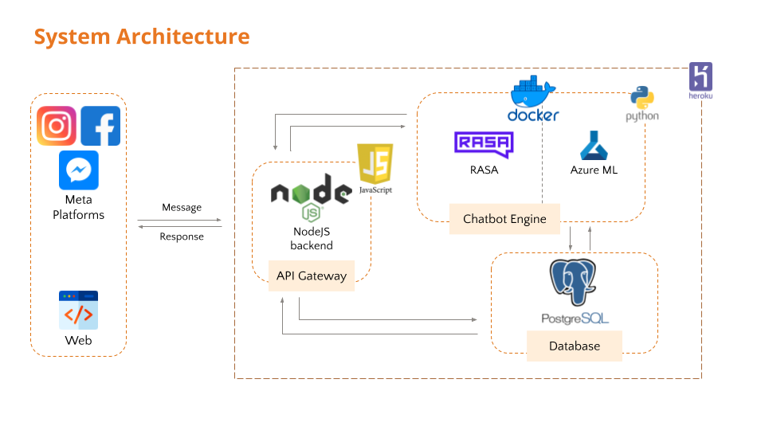
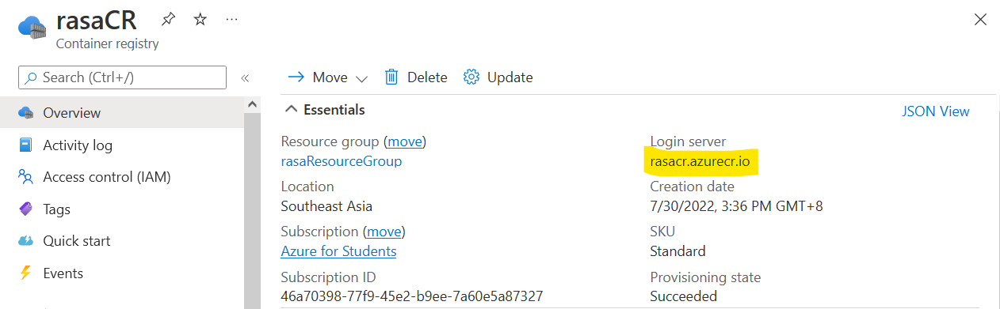

<h1 align="center">Capstone Chatbot</h1>

### Introduction
A chatbot hosted on Facebook that approaches customers with interactive features that encourages engagement between the brand and customers through providing assistance to customers’ queries and promoting awareness of the benefits of insurance, thereby leaving a memorable brand image on customers.

This is the README.md file for our [Rasa NLU](https://rasa.com/docs/) component. 

## Table of Contents
- [Table of Contents](#table-of-contents)
- [1. Tech Stack](#1-tech-stack)
- [2. Project Files Description](#2-project-files-description)
  - [Folder Structure](#folder-structure)
- [3. Installation & Configuration](#3-installation--configuration)
  - [Clone the repository](#clone-the-repository)
  - [Setting up the Virtual Environment (Windows User)](#setting-up-the-virtual-environment-windows-user)
  - [Setting up the Virtual Environment (Mac User)](#setting-up-the-virtual-environment-mac-user)
- [4. Rasa NLU Usage](#4-rasa-nlu-usage)
- [5. Deployment](#5-deployment)
  - [Push changes to Heroku](#push-changes-to-heroku)
  - [Make requests to Rasa](#make-requests-to-rasa)

## 1. Tech Stack
Here's a brief high-level overview of the tech stack:



## 2. Project Files Description
### Folder Structure
    .
    ├── app
        ├── data              This folder contains all NLU and RULES and STORIES files
        ├── config.yml        Configurations for the entire pipeline of the chatbot
        ├── domain            Contains all the intent and all the utters (responses) for each intent
        ├── endpoints.yml
        └── credentials.yml    
    ├── requirements.txt      Stores all packages on which that project is dependent on to run
    ├── .gitignore            Specifies intentionally untracked files that Git should ignore
    ├── server.sh
    ├── docker-compose.yml    Config file for Docker Compose to deploy, combine, and configure multiple docker containers at the same time
    ├── Dockerfile            Commands used to assemble a Docker image
    ├── images                Images used in README.md
    └── README.md             Provides overview of the repository

## 3. Installation & Configuration

### Clone the repository
To clone the repository, install [git](https://git-scm.com/downloads) and run:
```
git clone x
```
Change directory into the repository:
```
cd rasa-salesbot-v2
```

### Setting up the Virtual Environment (Windows User)
Install virtualenv:

```
pip install venv
```
Inside the project root folder, create a new virtual environment:

```
python -m venv ./venv
```

Activate virtualenv:
```
.\venv\Scripts\activate
```

Install the Python packages:
```
pip install -r requirements.txt
```

To deactivate the virtual environment:
```
deactivate
```

### Setting up the Virtual Environment (Mac User)

Inside the project root folder, create a new virtual environment:
```
virtualenv env
```

Activate virtualenv:
```
source env/bin/activate
```

Install the Python packages:
```
pip install -r requirements.txt
```

To deactivate the virtual environment:
```
deactivate
```

## 4. Rasa NLU Usage


For more information:
https://rasa.com/docs/rasa/testing-your-assistant/

Change folder directory into Rasa:
```
cd app
```

To train an NLU Model using the NLU data and stories:

```
rasa train nlu
```

Perform a 80/20 split NLU data into train and test sets:

```
rasa data split nlu
```

Test NLU model on the test set:

```
rasa test nlu --nlu train_test_split/test_data.yml
```

Use cross validation:

```
rasa test nlu --nlu data/nlu.yml --cross-validation
```

To load the trained model and talk to the Rasa chatbot on the command line:
```
rasa shell -m models
```

## 5. Deployment on Heroku (Not advised)
### Push changes to Heroku
Install [Heroku CLI](https://devcenter.heroku.com/articles/heroku-cli#download-and-install).
Log in to Heroku using the Heroku CLI. 
```
heroku login
```
> Please note that you need to be a collaborator in the heroku app.

You can now make changes to the RASA NLU by pushing the changes.
```
git add .
git commit -am "comments"
git push heroku master
```
Heroku will automatically handle the changes, re-build NLU model and re-start the server.
> Please note that locally trained NLU models won't be pushed to the Heroku repository.

### Make requests to Rasa (Advised option)
Once your server is deployed, you can make requests to your NLU model via [Rasa HTTP API](https://rasa.com/docs/rasa/api/http-api/#operation/parseModelMessage)
For example:
```
curl https://<your Heroku application name>.herokuapp.com/model/parse -d '{"text":"hello"}'
```

## 6. Deployment on Azure
### Building the Docker image
Install [Docker](https://docs.docker.com/engine/install/) and run:
```bash
docker build -t <imageID>
```
To run the Docker image locally:
```bash
docker run <imageID>
```
### Setting up Azure environment
Install [Azure CLI](https://docs.microsoft.com/en-us/cli/azure/install-azure-cli) and login to Azure:
```
az login
```

Setup the right subscription if required:
```
az account set --subscription <Subscription Name>
```

Create the resource group:
```
az group create --name rasaResourceGroup --location southeastasia
```

Create container registry:
```
az acr create --resource-group rasaResourceGroup --name rasaCR --sku Basic
```
> Make sure the container is unique, you can check [here](https://docs.microsoft.com/en-us/rest/api/containerregistry/registries/check-name-availability?tabs=HTTP#code-try-0)

Log in to the container registry:
```
az acr login --name rasaCR
```

### Hosting on Azure
- In the Azure dashboard, click on the container registry created and get the login server as shown in the image

Run the command: 
```
docker tag <imageID> <Login server>/<imageID>
```

- Push the Docker image onto Azure
```
docker push <Login server>/<imageID>
```

## 7. Deployment locally using ngrok
Install ngrok using [Chocolatey](https://docs.chocolatey.org/en-us/choco/setup)
```bash
choco install ngrok
```

Connect your account
```bash
ngrok config add-authtoken <authtoken taken from dashboard.ngrok.com>
```

Start HTTP tunnel forwarding to local port 5005
```bash
ngrok http 5005
```
